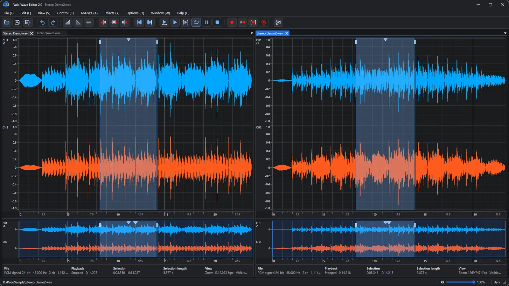
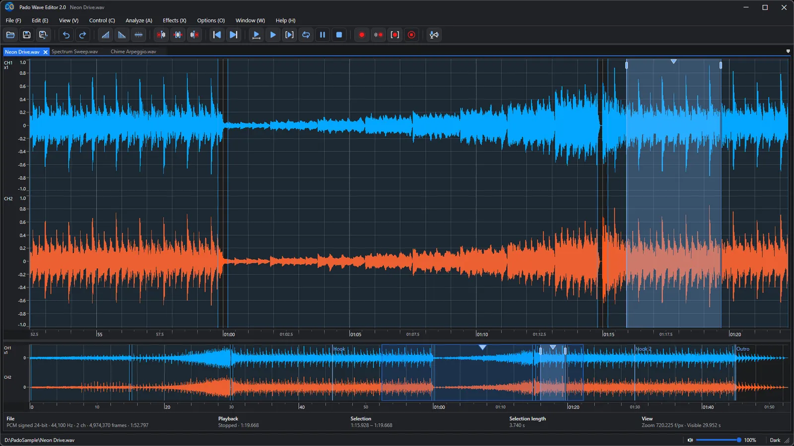
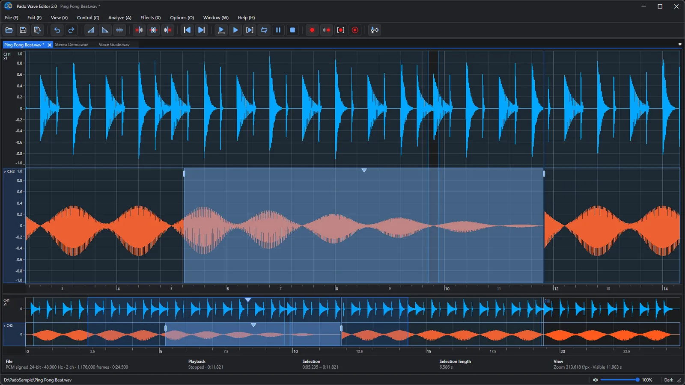
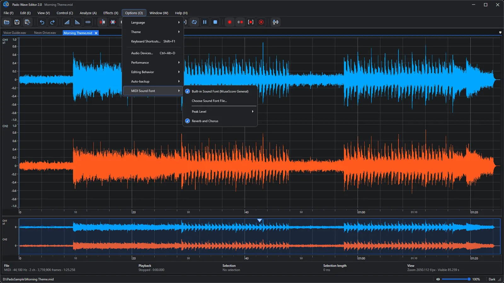
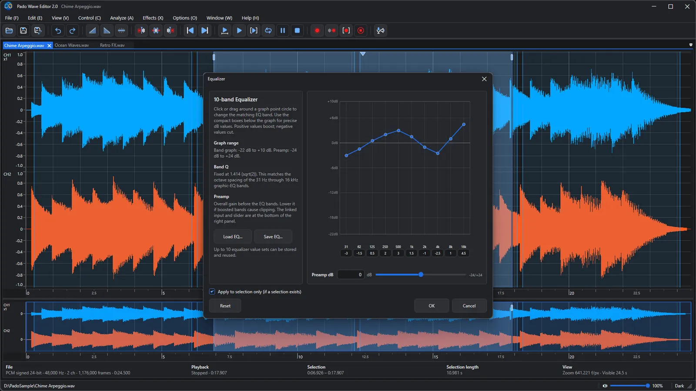
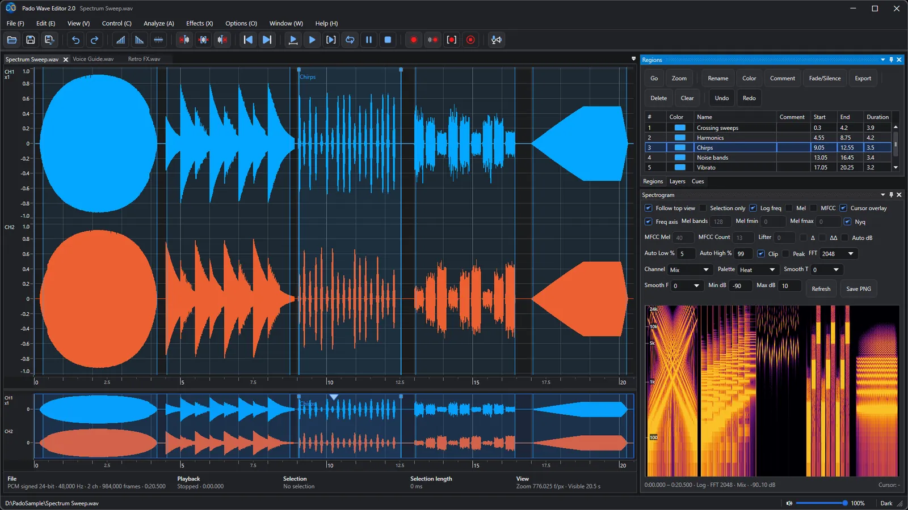
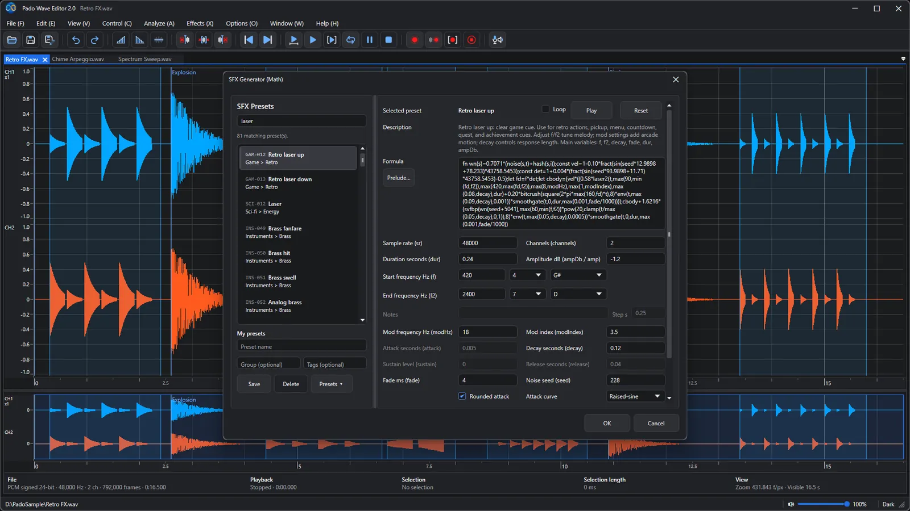
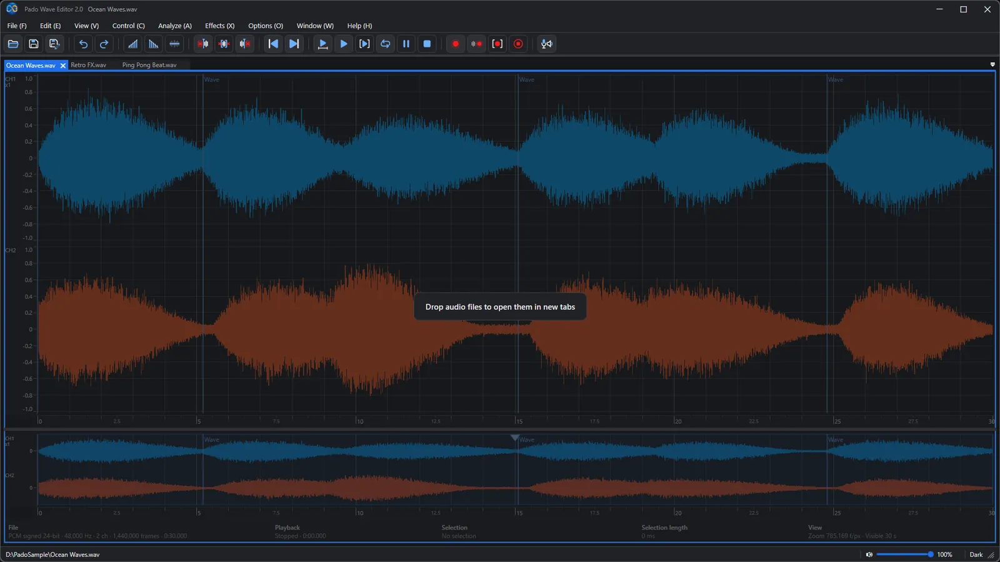
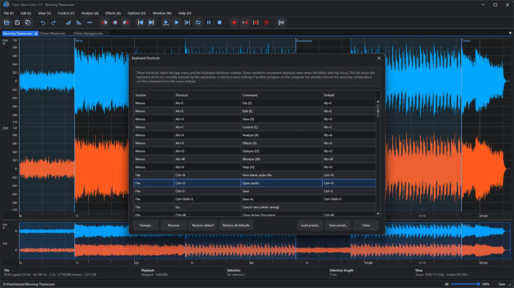
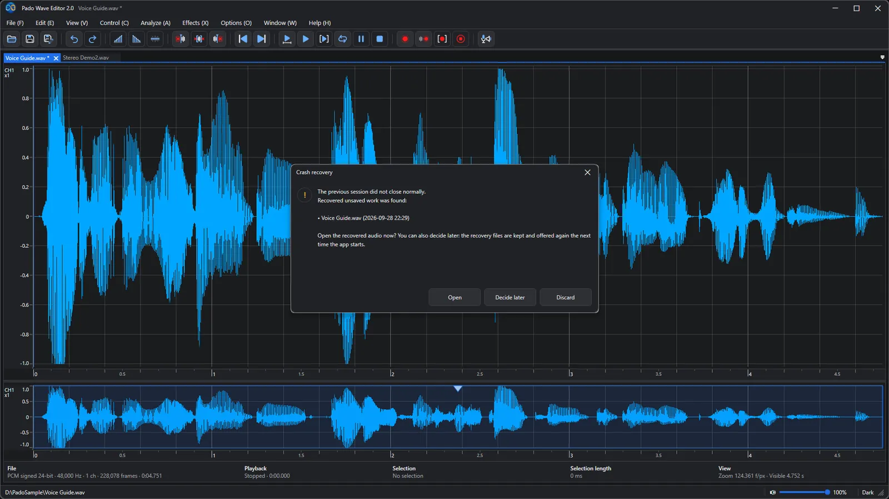

🌐 **Languages**

🇺🇸 [English](README.md) |
🇰🇷 [한국어](README_ko.md) |
🇯🇵 [日本語](README_ja.md) |
🇨🇳 [简体中文](README_zh-Hans.md) |
🇹🇼 [繁體中文](README_zh-Hant.md) |
🇩🇪 [Deutsch](README_de.md) |
🇫🇷 [Français](README_fr.md) |
🇪🇸 [Español](README_es.md) |
🇷🇺 [Русский](README_ru.md) |
🇧🇷 [Português (Brasil)](README_pt-BR.md) |
🇵🇹 [Português (Portugal)](README_pt-PT.md) |
🇸🇦 [العربية](README_ar.md) |
🇮🇳 [हिन्दी](README_hi.md) |
🇮🇩 [Bahasa Indonesia](README_id.md)

    

# Pado Wave Editor 2.0

### Бесплатный аудиоредактор, в котором звук видно — и его легко резать, вставлять и доводить до ума

Записи голоса, репетиции песен, звуковые эффекты для ваших видео — перетащите файл в окно, и волна сразу на экране. Выделите фрагмент, вырежьте, добавьте затухание, сохраните. Готово. Всё устроено просто, чтобы даже новичок не заблудился.

**Бесплатно** · **Windows 10 · 11** · **WAV · MP3 · FLAC · OGG · MIDI** · **14 языков** · **Светлая и тёмная темы**

[Скачать в Microsoft Store](https://apps.microsoft.com/detail/9nj5928hw9pw) · [Подробное руководство и частые вопросы](https://easyflow.co.kr/F/Doc/PadoWaveEditor/ru) · [Предыдущая версия (1.0)](v1.0/README_ru.md)

<i>Закрепляйте два файла рядом и воспроизводите их или зацикливайте при сравнении</i>

---

## Идеально, когда нужно

- 🎙️ **Почистить запись голоса** — Вырезать оговорки и длинные паузы из подкастов, презентаций и голосовых заметок и выровнять громкость.
- 🎧 **Сравнить два дубля** — Поставить два файла рядом, зациклить один и тот же фрагмент в каждом и оставить лучший.
- 🎹 **Превратить MIDI в аудио** — Откройте MIDI-трек — он сразу прозвучит и превратится в волну. Доработайте и сохраните в WAV или MP3.
- 🎮 **Звуки для игр и видео** — Выберите в пресетах лазеры, взрывы или сигналы уведомлений и сделайте свои звуки за пару кликов.
- 🎼 **От игры к нотам** — Найдите ноты в записанном исполнении и посмотрите их в нотной записи. Щёлкните ноту, исправьте её положение, высоту или длительность клавишами со стрелками (или удалите клавишей Delete) и сохраните MIDI-файл.
- 🔍 **Заглянуть внутрь звука** — Находить шум и щелчки на глаз с помощью спектрограммы и частотного анализа.

## Три шага — и готово

1. **Открыть** — Перетащите файл в окно или нажмите Ctrl+O. Открываются WAV, MP3, FLAC, OGG и MIDI.
2. **Выделить и изменить** — Проведите по волне, чтобы выделить фрагмент, затем вырежьте, добавьте затухание или эффекты. Ошиблись? Ctrl+Z.
3. **Сохранить** — Нажмите Ctrl+S или экспортируйте в нужный формат.

---

## Обзор возможностей

### 01. Редактируйте аудио в наглядном рабочем пространстве с многоканальными формами волн

Редактируйте в большой волне сверху, а полоса обзора снизу показывает, где вы находитесь во всём файле. Сведения о файле, позиция воспроизведения и длина выделения всегда видны в информационной строке прямо под волной. Длинные файлы сначала быстро показывают волну, а детали дорисовывают потом — ждать почти не приходится.

### 02. Выбирайте и редактируйте все каналы вместе или по одному

В стерео можно выделить левый (верхний) и правый (нижний) каналы вместе или только один. Уберите шум, который есть лишь с одной стороны, или сделайте затухание в одном канале — тонкая правка становится простой.

### 03. Открывайте файлы MIDI как форму волны, воспроизведённую встроенным звуковым банком

В MIDI-файле (.mid, .midi, .rmi) хранятся ноты, а не звук. Pado Wave Editor проигрывает его встроенным саундфонтом (MuseScore General) и показывает результат как волну — режьте, добавляйте эффекты и сохраняйте в WAV или MP3, как обычное аудио. Нравится другой саундфонт SF2 или SF3? Переключите его в параметрах.

### 04. Настраивайте и анализируйте звук с помощью эффектов, фильтров и инструментов анализа

Применяйте эквалайзер, фильтры, компрессор, нормализацию и другое только к выделенному фрагменту. Перетаскивайте точки на графике, чтобы менять звук, и сохраняйте до 10 настроек эквалайзера, чтобы загрузить их позже.

### 05. Перемещайтесь по аудио с помощью областей, меток, слоёв и спектрограммы

Регионы с именами и цветами, метки позиций и слои, в которых обработку можно включать и выключать для сравнения, помогают не потеряться даже в длинных файлах. Спектрограмма показывает звук цветом по частотам, так что шум и щелчки видны сразу.

### 06. Создавайте звуковые эффекты из сотен пресетов на основе формул

Ищите среди сотен пресетов — лазеры, взрывы, сигналы и даже инструменты, — меняйте частоту, длительность и затухание и сразу слушайте результат. Понравившееся сохраняйте как свои пресеты. Отлично подходит, чтобы делать свои звуки для игр и видео.

### 07. Перетаскивайте аудиофайлы в редактор, чтобы открыть их в новых вкладках

Просто перетащите аудиофайлы из Проводника в окно — каждый откроется в новой вкладке. Можно бросить сразу несколько файлов.

### 08. Просматривайте и настраивайте сочетания клавиш

Меню и сочетания клавиш — в одной таблице: меняйте любую клавишу или возвращайте значение по умолчанию. Сохраните свою раскладку как пресет и загружайте её когда угодно.

### 09. Автоматически восстанавливайте несохранённую работу после неожиданного закрытия

Если приложение внезапно закрылось — без паники. При следующем запуске оно найдёт несохранённую работу и спросит, открыть её, решить позже или удалить. Если выбрать «позже», файлы восстановления сохранятся и будут предложены снова при следующем запуске.

---

## Что нового в 2.0

Версия 2.0 — крупное обновление: повседневное редактирование стало проще, быстрее и надёжнее.

- **MIDI как форма волны.** Файл MIDI (.mid) воспроизводится встроенным звуковым банком и открывается как форма волны: её можно редактировать как обычное аудио и сохранить в WAV, MP3 и других форматах.
- **Справка для новичков.** Встроенная справка переписана простым языком и шаг за шагом проводит через открытие файла, выделение фрагмента, редактирование и сохранение.
- **Перетаскивание.** Перетащите аудиофайлы в окно, чтобы открыть их.
- **Больше форматов.** Открывайте и сохраняйте файлы Ogg Vorbis (.ogg), в том числе с объёмным звуком 5.1 и 7.1, а FLAC теперь работает во всех выпусках Windows.
- **Настраиваемые сочетания клавиш.** Назначьте сочетания так, как вам удобно работать.
- **Длинные файлы и записи.** Длинные файлы открываются и сохраняются заметно быстрее, а звук пишется на диск прямо во время записи, поэтому приложение не тормозит в долгих сессиях.
- **Автоматическое восстановление файлов.** Если приложение неожиданно закроется, работа восстановится при следующем запуске.
- **Улучшенный звук по USB.** Подключение и замена USB-микрофонов и колонок определяются надёжнее.
- **Пользовательские пресеты SFX Generator, второе поколение.** Больше пресетов и лучше качество звука.
- **Обновлённый вид.** Более чистые и чёткие значки панели инструментов, цвета тем настроены для светлого и тёмного режимов.
- Общее повышение стабильности и надёжности во всём приложении.

## Все возможности с первого взгляда

- Открывайте поддерживаемые аудиофайлы и редактируйте все каналы вместе или один канал отдельно.
- Открытие файлов MIDI (.mid, .midi, .rmi) как редактируемой формы волны, воспроизведённой встроенным звуковым банком.
- Распознавание нот в записи, просмотр в виде партитуры, исправление и сохранение в файл MIDI.
- Вырезайте, копируйте, вставляйте, удаляйте, отключайте звук, применяйте fade, отмену и повтор.
- Воспроизводите, зацикливайте, записывайте, сохраняйте и экспортируйте в одном рабочем окне.
- Используйте области, метки, слои и спектрограмму для навигации и визуального анализа.
- Применяйте удаление DC, фильтры, эквалайзер, bass shelf, компрессор, громкость, нормализацию и hard clip.
- Меняйте скорость, выполняйте ресемплинг и создавайте звуки в SFX Generator.
- Уменьшайте щелчки автоматическим кроссфейдом, привязкой и короткими fade.
- Сохраняйте отзывчивость длинных файлов благодаря режиму слабого ПК и поэтапному уточнению волны.

Интерфейс и встроенная справка локализованы. Некоторые стандартные названия эффектов, форматов файлов и технические термины остаются на английском.

## Требования

Поддерживаемые форматы: WAV, AIFF, FLAC, Ogg Vorbis, MP3, WMA. Для MP3 и WMA используются мультимедийные компоненты Windows, входящие в большинство выпусков Windows; в выпусках Windows N установите бесплатный Media Feature Pack (Параметры > Приложения > Дополнительные компоненты), чтобы включить их. WAV, AIFF, FLAC и Ogg Vorbis работают всегда. Встроенное средство просмотра справки использует Microsoft Edge WebView2 Runtime, который входит в состав Windows 11 и уже установлен на большинстве компьютеров с Windows 10; если его нет, затрагивается только просмотр справки, а редактирование звука продолжает работать.

---

## Скачать

- [Скачать в Microsoft Store](https://apps.microsoft.com/detail/9nj5928hw9pw)
- Установщик из **Releases** тоже открывает Microsoft Store и устанавливает официальную версию.
- [Подробное руководство и частые вопросы](https://easyflow.co.kr/F/Doc/PadoWaveEditor/ru)
- [Предыдущая версия (1.0)](v1.0/README_ru.md)

© 2026 Easyflow Inc.
