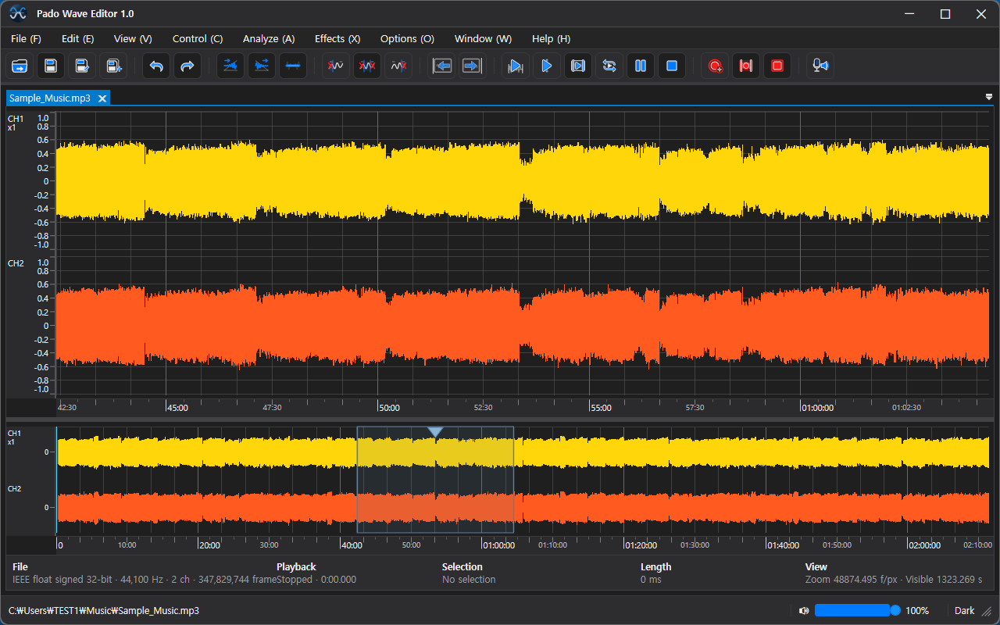
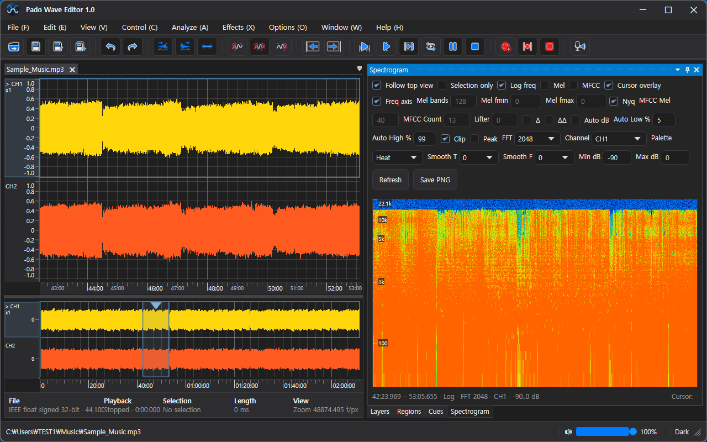
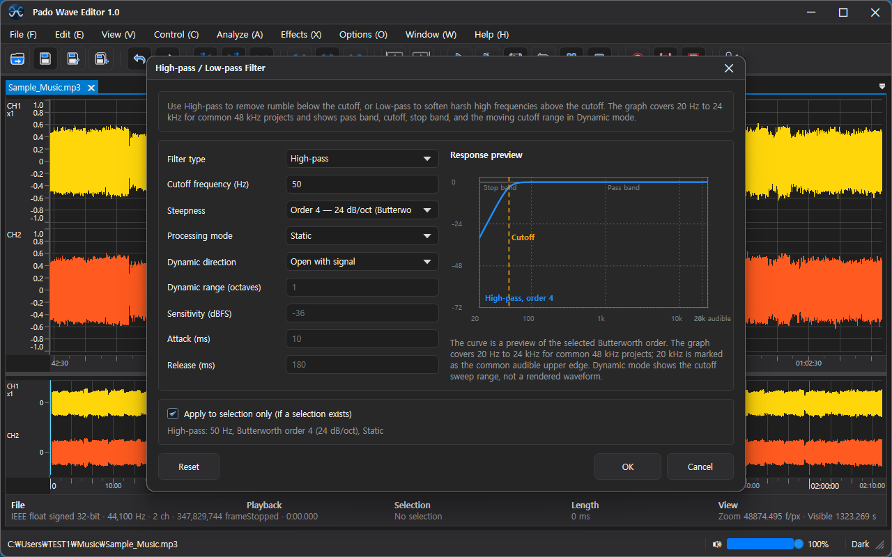
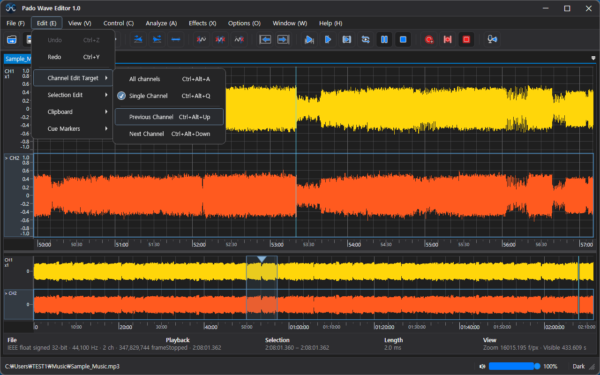
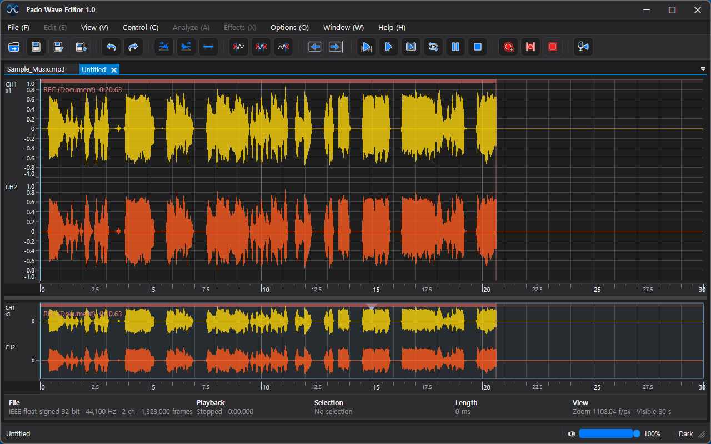

🌐 **Languages**

🇺🇸 [English](README.md) |
🇰🇷 [한국어](README_ko.md) |
🇯🇵 [日本語](README_ja.md) |
🇨🇳 [简体中文](README_zh-Hans.md) |
🇹🇼 [繁體中文](README_zh-Hant.md) |
🇩🇪 [Deutsch](README_de.md) |
🇫🇷 [Français](README_fr.md) |
🇪🇸 [Español](README_es.md) |
🇷🇺 [Русский](README_ru.md) |
🇧🇷 [Português (Brasil)](README_pt-BR.md) |
🇵🇹 [Português (Portugal)](README_pt-PT.md) |
🇸🇦 [العربية](README_ar.md) |
🇮🇳 [हिन्दी](README_hi.md) |
🇮🇩 [Bahasa Indonesia](README_id.md)

    

# Pado Wave Editor

**适用于 Windows 的专业音频波形编辑器**

一款快速、精准且功能强大的 Windows 音频编辑软件。
提供波形编辑、频谱图（Spectrogram）分析、FFT 频率分析、专业音频滤波器以及录音功能，帮助您高效完成各种音频处理任务。

---

# 下载

请从 **Releases** 页面下载最新安装程序。

运行安装程序后，**Microsoft Store** 将自动打开，并安装最新官方版本的 **Pado Wave Editor**。

---

# 主要功能

* 专业波形编辑
* 高性能音频处理引擎
* 多声道编辑
* 高通 / 低通滤波器
* 频谱图分析（Spectrogram）
* FFT 频率分析
* 精确缩放
* 实时播放
* 音频录制
* 支持大型音频文件
* 针对 Windows 10 和 Windows 11 优化
* 通过 Microsoft Store 自动更新

---

# 截图

## 主工作区

集成波形编辑工作区，包含概览导航、播放控制和精确缩放功能。

---

## 频谱图分析

使用内置频谱图和 FFT 可视化工具分析音频频率成分。

---

## 专业音频滤波器

提供高通、低通等专业音频处理工具。

---

## 声道编辑

可单独编辑各个声道，也可同时处理所有声道。

---

## 录音

可直接在 Pado Wave Editor 中录制音频。

---

# 安装方法

1. 下载 **Pado.Wave.Editor.Installer.exe**。
2. 运行安装程序。
3. Microsoft Store 将自动打开。
4. 安装 **Pado Wave Editor**。

---

# 系统要求

| 项目              | 要求                      |
| --------------- | ----------------------- |
| 操作系统            | Windows 10 / Windows 11 |
| 系统架构            | x64                     |
| Microsoft Store | 必需                      |
| 网络连接            | 安装时需要                   |

---

# 反馈

如果您发现任何问题，请创建 **GitHub Issue**。

也欢迎提交功能建议和改进意见。

---

# 技术支持

[easyflowinc@naver.com](mailto:easyflowinc@naver.com)

---

# 版权所有

© EasyFlow Inc.

保留所有权利。

Pado Wave Editor 是一款商业软件。

本仓库仅提供 Microsoft Store 官方安装程序，不包含源代码。
